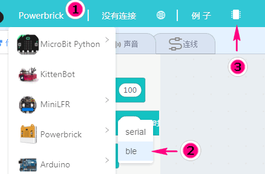
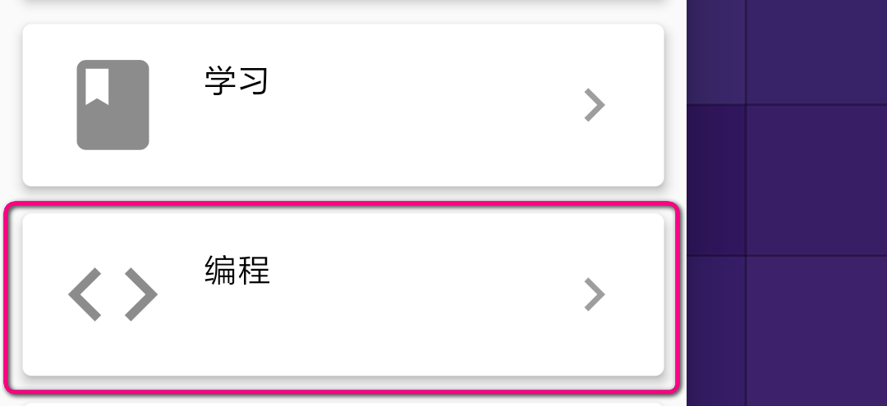
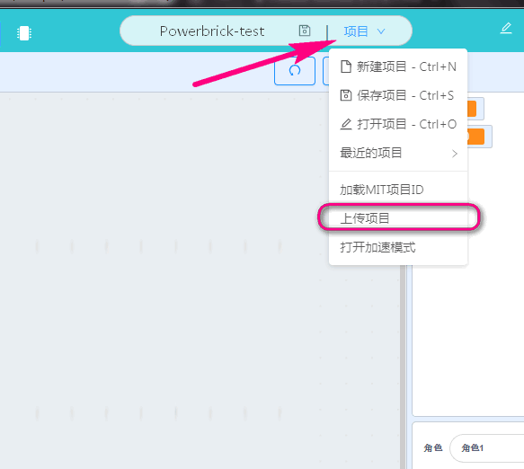
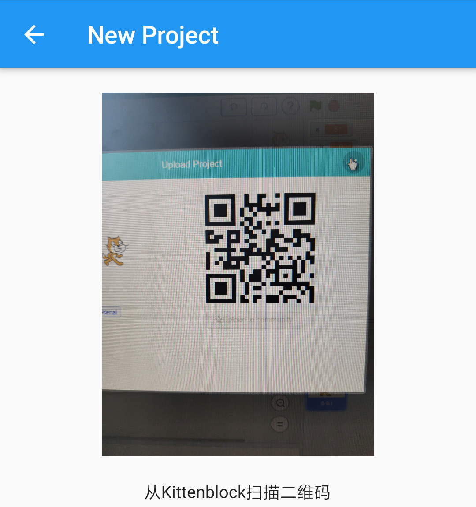
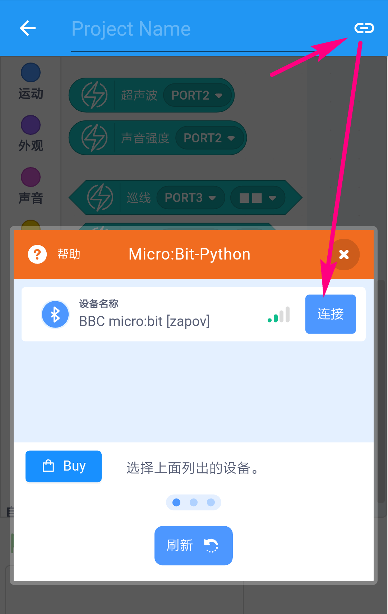
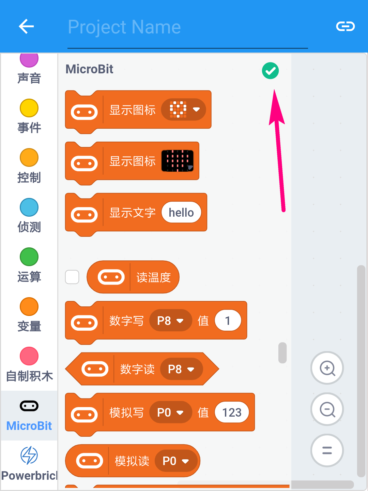

# Powerbrick使用指引  

## 蓝牙固件下载 

Powerbrick的主控为Microbit，由于Microbit板载蓝牙芯片，使得我们可以通过手机app对其进行连接。但若要对其进行编程及指令通讯则需要相对应的通讯固件。按照如下步骤将蓝牙的通讯固件下载到Microbit上。  

1. 打开kittenblock，如果你已经是老用户，那么依次选择Powerbrick => ble => 恢复固件 

  

`确保你的kittenblock版本号是1.84以上`  

`△.如果你是新用户，则转到小喵科技官网下载新版kittenblock`  
 https://www.kittenbot.cn/

2. 成功下载ble的通讯固件后，可见Microbit点阵屏上滚动着一串字符，为蓝牙的名字。 

## 打开手机蓝牙

## 编程准备  

此时我们进入编程模式 
  

`此时你可以新建项目下看到一些已经存在的例子项目，你可以点击Play进入。`

若你需要一个属于自己的新建项目：有2种方式新建一个项目  
- 直接点击按钮`新建一个空项目`  
- 通过kittenblock中的二维码将已经搭建好的程序在手机app上作为项目加载。  
 
如果你已经在kittenblock软件中搭建好了程序，则只需要扫一扫二维码，程序就能到app里。步骤如下：     
1. 依次点选`项目=>上传项目`  
2. 确保电脑和和手机都在同一个局域网或者wifi网络下，这样才能进行数据传输。  
3. 扫描出现的二维码即可   

## 进入编程  

在此之前，我们准备好了蓝牙固件，在进入编程界面后我们需要连接蓝牙

  

成功连接图示如下：原本的感叹号编程绿色的√图标  
 

△.完成上述步骤后你就可以通过在app上点击对应积木块来实现你想要的硬件控制效果。
