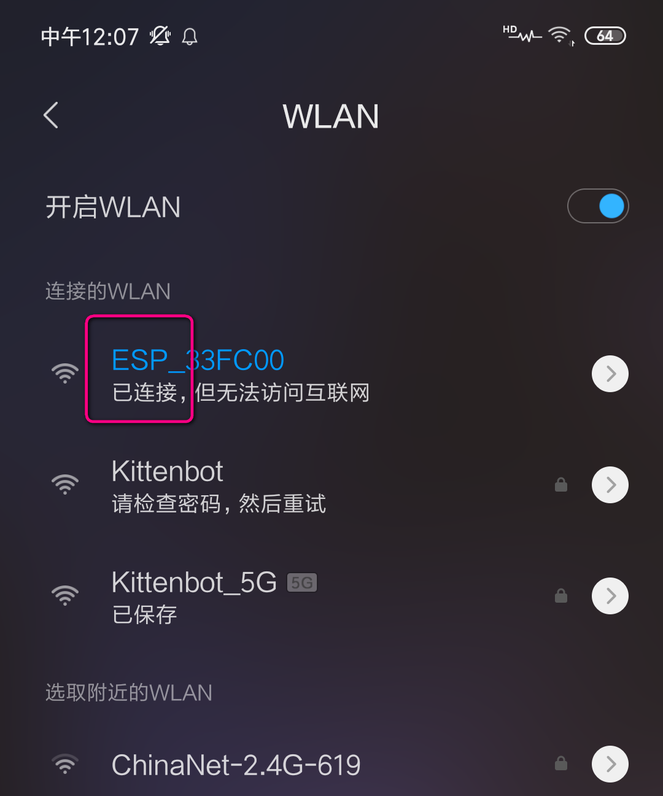
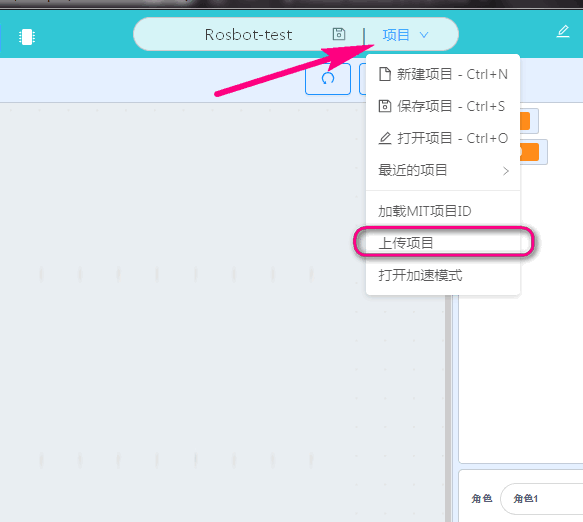
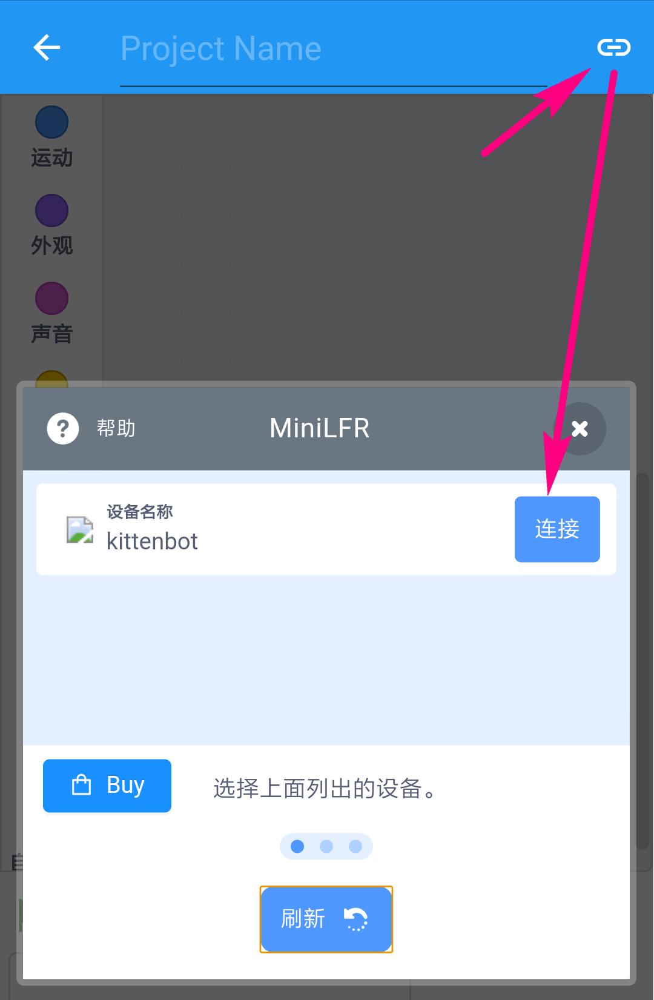
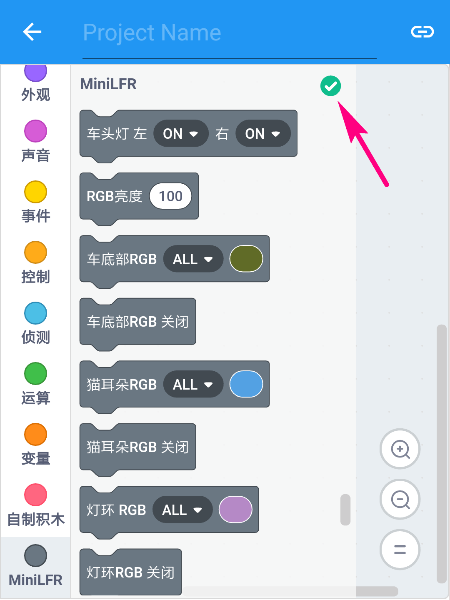

# miniLFR使用指引

## wifi的接插  

`由于miniLFR与手机app的连接需要无线设备支持，此处我们使用wifi进行连接。请确保你手上有喵家wifi模块`  

wifi的接插位置请参照图示,并且确保拨码开关拨向箭头所指方向(这个方向正常模式，该模式下其他设备能够搜索到wifi)
  

## 手机直连wifi 

当wifi正常接插在rosbot并给rosbot上电后，即可通过手机搜索到ESP_开头的wifi名称，这个即为wifi模块，只需点击直连即可。

  

## 进入编程模式  

此时我们进入编程模式 
  

`此时你可以新建项目下看到一些已经存在的例子项目，你可以点击Play进入。`

若你需要一个属于自己的新建项目：有2种方式新建一个项目  
- 直接点击按钮`新建一个空项目`  
- 通过kittenblock中的二维码将已经搭建好的程序在手机app上作为项目加载。  
 
如果你已经在kittenblock软件中搭建好了程序，则只需要扫一扫二维码，程序就能到app里。步骤如下：     
1. 依次点选`项目=>上传项目`   
2. 确保电脑和和手机都在同一个局域网或者wifi网络下，且`kittenblock版本在1.8.4及以上`这样才能进行数据传输。  
3. 扫描出现的二维码即可 

## app中连接wifi 

在手机连上wifi信号后，进入到kblock手机app，硬件选择Rosbot/Kittenbot类，随意新建一个项目并进入编程界面后如下图操作。  

  

要想搜索到设备，必须确保手机wifi已经连上wifi模块。如果一开始没有看到设备，可以点击下方刷新按钮。   

成功连接图示如下：原本的感叹号编程绿色的√图标  

△.完成上述步骤后你就可以通过在app上点击对应积木块来实现你想要的硬件控制效果。

