# Microbit使用指引  

## 蓝牙固件下载 

由于Microbit板载蓝牙芯片，使得我们可以通过手机app对其进行连接。但若要对其进行编程及指令通讯则需要相对应的通讯固件。按照如下步骤将蓝牙的通讯固件下载到Microbit上。  

1. 打开kittenblock，如果你已经是老用户，那么依次选择MicroBit Python => ble => 恢复固件 

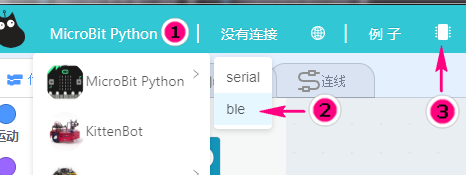  

`确保你的kittenblock版本号是1.84以上`   

`△.如果你是新用户，则转到小喵科技官网下载新版kittenblock`  
 https://www.kittenbot.cn/

2. 成功下载ble的通讯固件后，可见Microbit点阵屏上滚动着一串字符，为蓝牙的名字。 

## 打开手机蓝牙

## 编程模式  

此时我们进入编程模式 
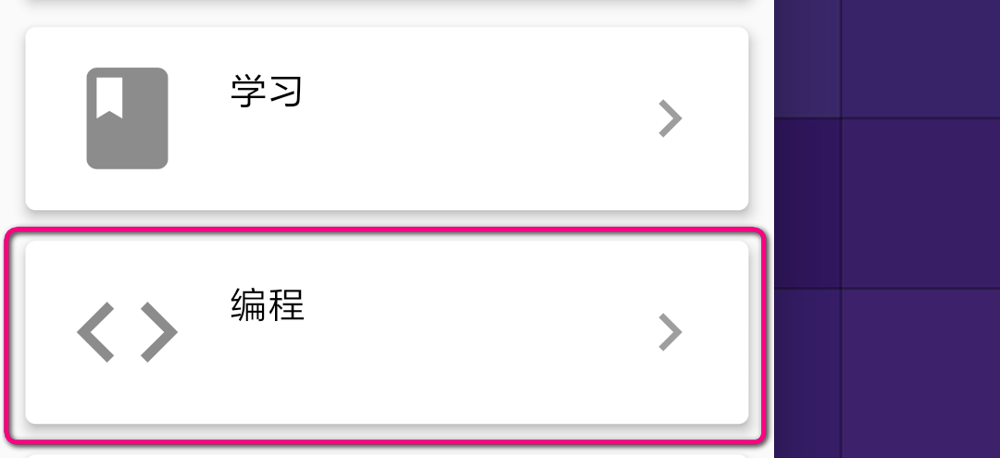  

新建项目：有2种方式新建一个项目  
- 直接点击按钮`新建一个空项目`  
- 通过kittenblock中的二维码将已经搭建好的程序在手机app上作为项目加载。  
 
如果你已经在kittenblock软件中搭建好了程序，则只需要扫一扫二维码，程序就能到app里。步骤如下：     
  
1. 依次点选`项目=>上传项目`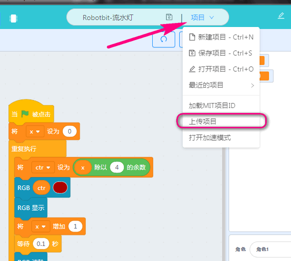    

2. 确保电脑和和手机都在同一个局域网或者wifi网络下，这样才能进行数据传输。    

3. 扫描出现的二维码即可 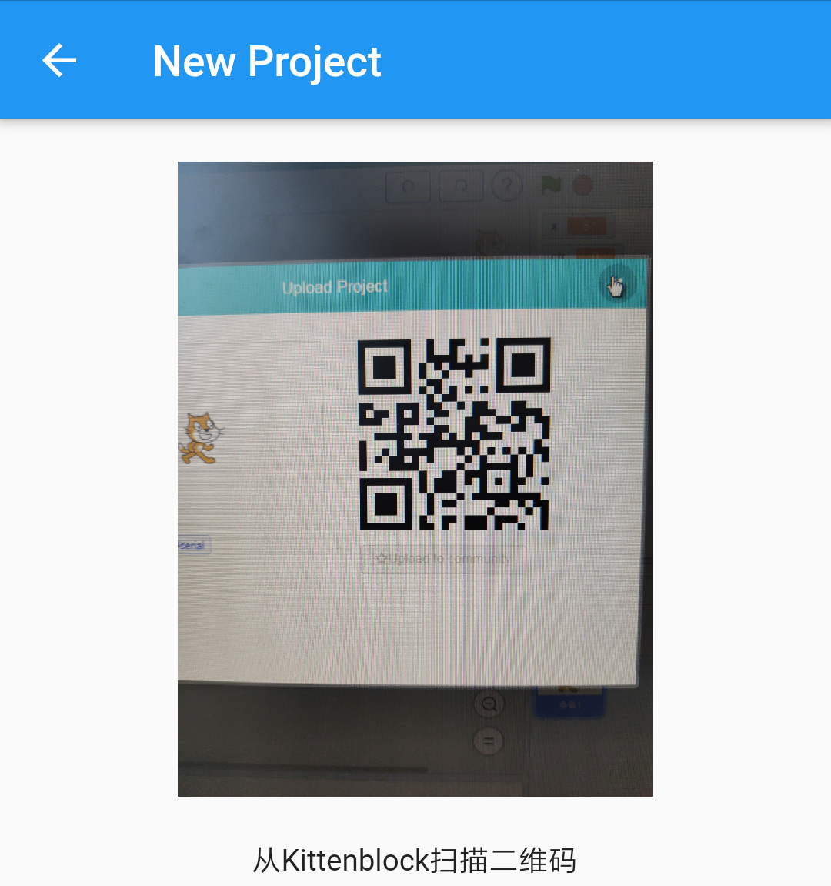    

4. 进入界面后连接蓝牙即可实现在线控制。 
  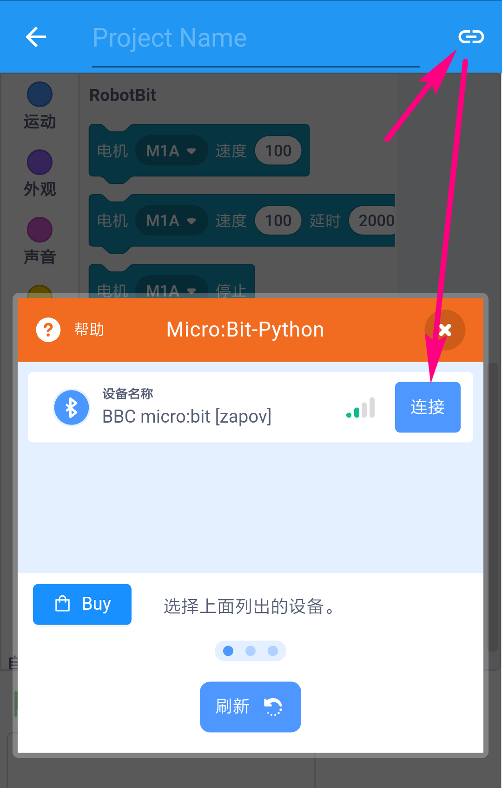  

连接成功如下： 原本的感叹号编程绿色的√图标  
  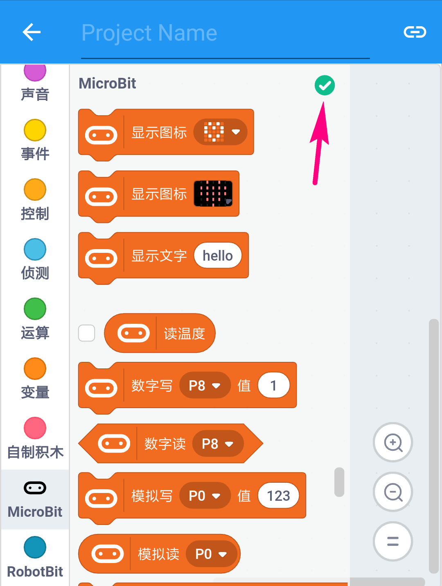

## 遥控模式  

遥控模式将允许你快速搭出一个简单的控制器，确保microbit中已经下载蓝牙固件，之后按照如下步骤：  

1. 进入遥控模式界面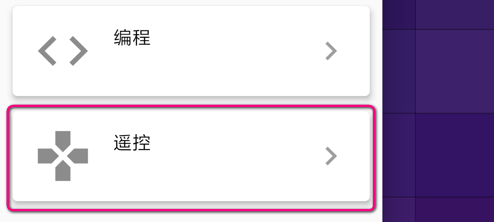  
2. 首先连接蓝牙 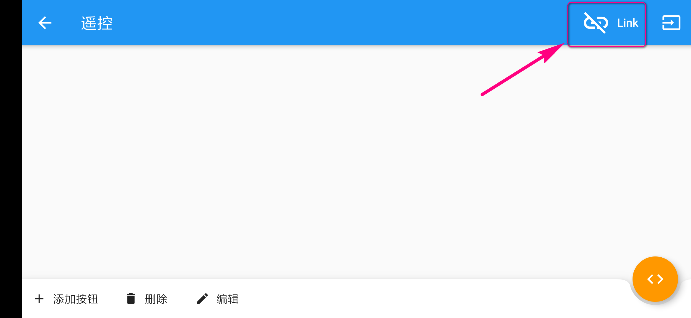  
如果没搜到蓝牙可能是你的手机蓝牙未开或固件未下载正确，如果确定上述都完成后，点选右上角的环形箭头刷新搜索 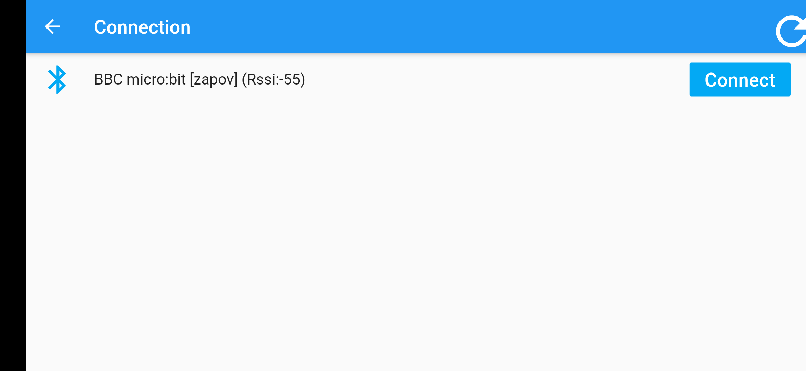 
当蓝牙连接建立后此图标变为   
通过这个按键可以切换控制界面的控制和编辑两种模式。如图此时处于控制模式，点选空白界面中的按键可以实现你编辑过的控制效果  
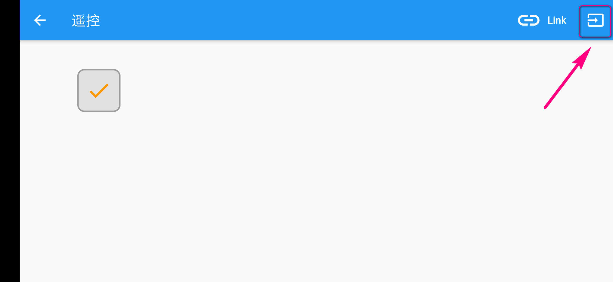  
但前提是需要先编辑，所以点击上图箭头指向的按钮切换到编辑模式对按键进行属性编辑。处于编辑模式时无法控制,反之处于控制模式无法编辑，此时界面底部会出现功能控件 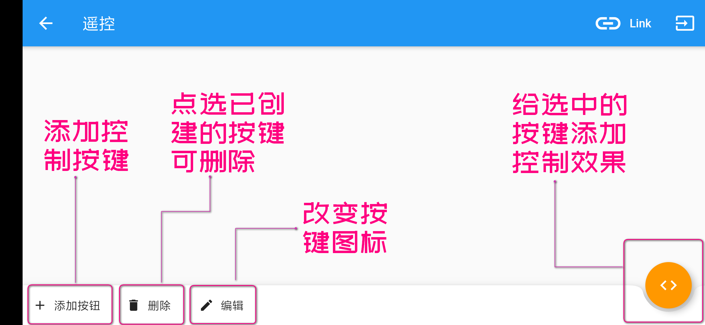 

当我们编辑好按键后只需要再切换回控制界面点击这个你已经编辑好的按钮就可以实现你要的控制效果了

