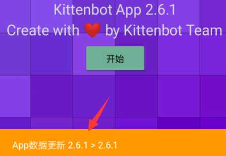
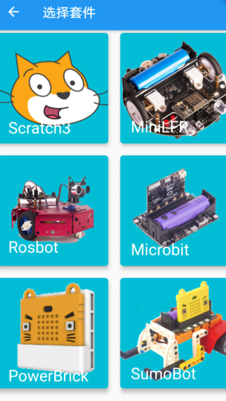
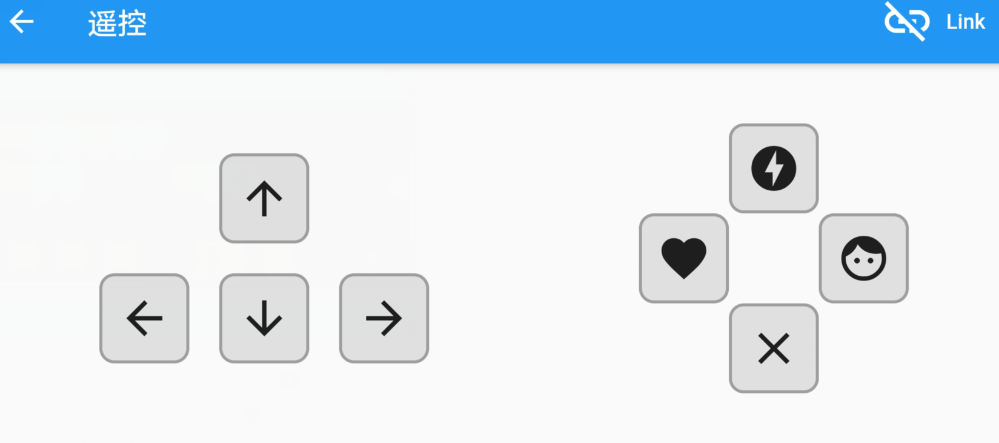
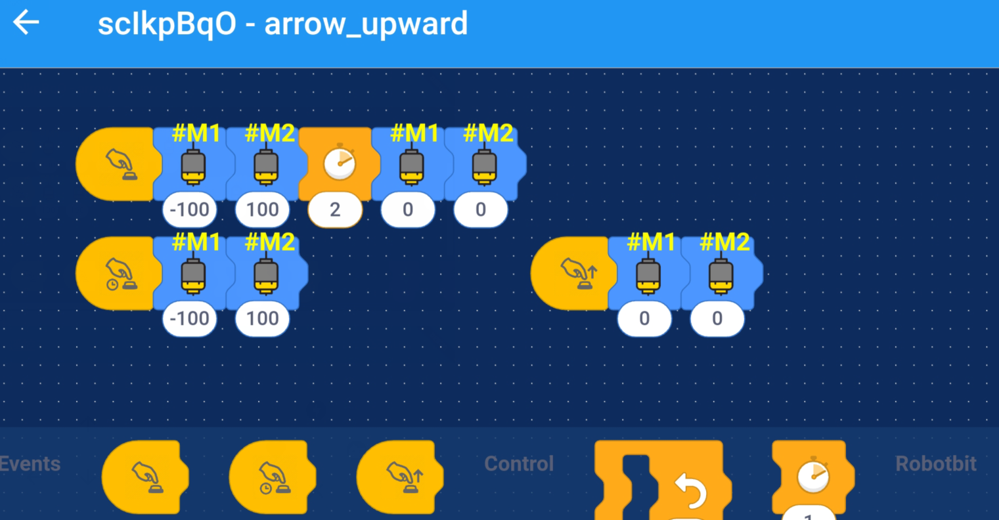
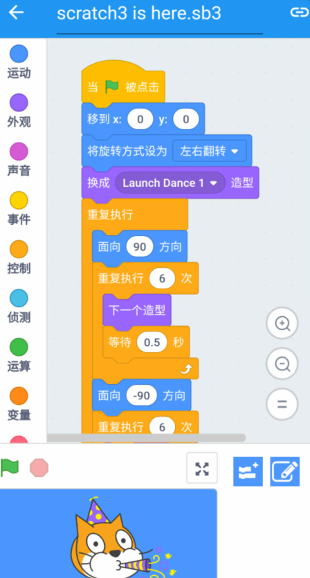
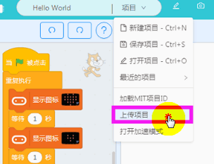

# Kittenblock app快速开始

## 首次启动

App首次启动会自动从服务器同步最新的资料并下载到手机中，这些资料包括相关的教程文档、示例程序、手柄遥控界面、scratch3编辑器代码和各种搭建文档等等。。

首次启动更新包大概30M左右，建议大家连接wifi并保证网络畅通。

万一更新失败可以点 `开始`打开侧边抽屉栏，之后在最左下处打开设置界面。接着点击重置数据库，app将会尝试重新下载缺失或之前下载失败的文件。

## 切换套件

大家可以通过点击右下角的硬件图标或者抽屉栏第一项切换硬件。切换硬件后会重新加载对应的资源文件，根据套件的不同抽屉栏中可能会显示：教程、编程、遥控、搭建或者课程等等~

套件间的项目相互间独立存在，也就是你在A套件下保存的项目在B套件是看不到的。

## 遥控模式

遥控模式是在大家强烈建议下在2.6版本加入的，但是每个按钮都是可编程的，编程模式套用了ScratchJR类似的横版引擎，不同套件下的按钮所呈现的积木块也不一样。

遥控编程栏主要有三个入口，分别是 `按钮点击`、`按钮长按` 和 `按钮松开`

目前遥控模式只提供最基本的遥控指令，并且没有异步读取的积木块，如果需要完整的功能请使用编程模式。

大家有什么想法或者相加的功能请尽管跟我们提出来~

## 编程模式

编程模式继承自通用的Scratch3，大部分scratch3项目都应该能在手机上打开。但是目前基于摄像头的插件，外挂式的插件在手机端还不支持，不过在接下来几个版本迭代中应该可以完成~

### 同步kittenblock项目到app

请在Kittenblock项目下来栏点击`上传项目`， 并在新建项目处扫描二维码同步到app端。

这个过程中请一定要保证Kittenblock在同一个局域网内，不然可能会导致同步失败。

