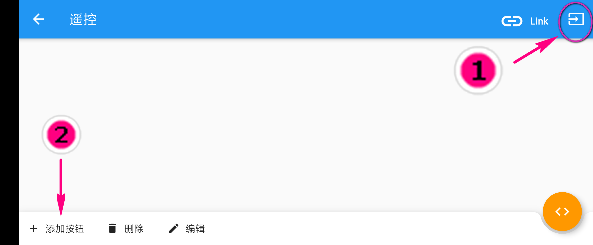

# 格斗小车使用指引 

## 蓝牙连接准备
1. 通过手机APP与格斗小车的连接实质上就是与microbit的蓝牙连接。包括如下的编程和遥控都需要蓝牙通讯，能够通讯的前提是APP与microbit之间需要有一个互通的桥梁，这个桥梁就是microbit蓝牙通讯固件。为此我们需要在kittenblock中下载这个固件。

2. kittenblock的老玩家可以直接在kittenblock恢复microbit的ble固件即可。对于新玩家请按照如下提示：
- 首先你需要最新版kittenblock，通过如下链接下载1.84版本
    - 1.84 绿色版本：https://cdn.kittenbot.cn/win/Kittenblock Setup 1.8.4.exe
    - mac: https://cdn.kittenbot.cn/mac/Kittenblock-1.8.4.dmg

- 选择MicroBit Python下的ble，并点选箭头2所指的按钮，下载固件(即恢复固件) 
   

## 快速搭建遥控器 

1. 首先点选主界面中的遥控 
  

2.  点选右上角的搜索到蓝牙并且连接。`前提是确保已经给microbit在kittenblock中下载了蓝牙固件，并且开启了手机的蓝牙`  

3. 点击右上角按钮，可以看到底下出现了一行编辑控件，之后点选添加按钮 

4. 添加了按钮之后，默认图标为√，可以通过编辑改变一下图标，之后点选右上角的黄色按钮进入给按钮添加控制代码
   

5. 每个积木块的功能可以自行尝试，都很简单，目前先试着按照图中搭建的进行，搭建完后点击左上角的回撤图标返回到主界面。`点击M1 M2 M3 M4分别表示robotbit板子上的M1A M1B M2A M2B` 
  

6. 回来之后是这个界面，但仍处于编辑模式点击右上角图标切换到控制模式
    
在这个界面下试着点击一下你刚刚编辑好的按钮看看现象吧    
   

`编程相关请参考Microbit/Robotbit中的学习指引`

 

